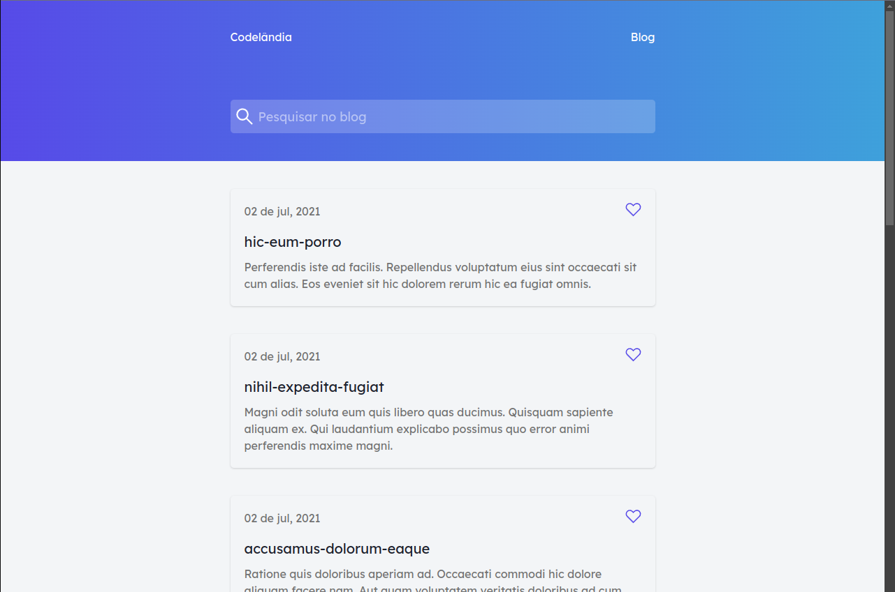

<h1 align="center">
  Codelândia Blog
</h1>

  

That project was created to practice the Storybook and Chakra UI tools.

## Getting Started

In the project directory, you can run:

### `yarn start`

Runs the app in the development mode.  Open
[http://localhost:3000](http://localhost:3000) to view it in the browser.

### `yarn build`

Builds the app for production to the `build` folder.  It correctly bundles
React in production mode and optimizes the build for the best performance.

## Built With

- [Create React App](https://create-react-app.dev/);
- [Chakra UI](https://chakra-ui.com/);
- [Storybook](https://storybook.js.org/);
